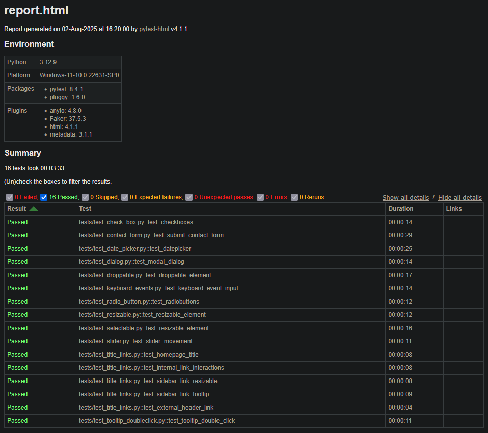

# 🧪 DemoQA Test Automation Suite

This project contains a fully functional and demonstrative test suite using **Selenium WebDriver** and **Pytest** for automating various components of the [DemoQA](https://demoqa.com/) website. It is designed to showcase real-world web automation practices, particularly for quality assurance portfolios or interviews.

---

## ✅ What This Test Suite Covers

This test suite simulates user interactions across multiple UI components:

* Checkbox functionality (tree expansion + selection)
* Contact form submission
* Date Picker selection
* Modal Dialog behavior
* Drag and Drop targets
* Keyboard Event simulation
* Radio Button selection
* Resizable UI elements
* Selectable list items
* Sliders and value adjustments
* Page Title and Link Validation
* Tooltip and Double Click Interactions

Each test is structured, stable, and designed for reusability and real-world demonstration.

---

## 📁 Project Structure

```
DemoQA-TestSuite/
├── tests/
│   ├── test_check_box.py
│   ├── test_contact_form.py
│   ├── test_date_picker.py
│   ├── test_dialog.py
│   ├── test_droppable.py
│   ├── test_keyboard_events.py
│   ├── test_radio_button.py
│   ├── test_resizable.py
│   ├── test_selectable.py
│   ├── test_slider.py
│   ├── test_title_links.py
│   └── test_tooltip_doubleclick.py
├── reports/                       # Stores generated HTML reports
│   └── report.html
├── requirements.txt               # Dependencies
└── README.md                      # Project documentation
```

---

## 🚀 How to Set Up and Run Tests

### 1. Clone the Repository (Optional)

```bash
git clone https://github.com/letsconfuse/DemoQA.git
cd DemoQA
```

### 2. Install Python Dependencies

Make sure you have Python 3 installed. Then run:

```bash
pip install -r requirements.txt
```

### 3. Run All Tests and Generate HTML Report

```bash
pytest --html=reports/report.html --self-contained-html
```

### 4. View the Report

Open the `report.html` file in the `reports/` directory using any browser.



---

## 🧰 Technologies & Tools Used

* **Selenium WebDriver** – Automates browser interactions
* **Pytest** – For test execution and management
* **pytest-html** – For generating test result reports
* **Python 3.x** – Core programming language used

---

## 📌 Important Notes

* All test selectors are stable and tested (using `xpath` or `css selectors`)
* Includes implicit waits and occasional `time.sleep()` to ensure page readiness
* Tests are modular and easy to extend for future DemoQA elements

---

## 📸 Sample Test Output

```text
✔ tests/test_Check_Box.py::test_checkbox_minimal PASSED
✔ tests/test_contact_form.py::test_submit_contact_form PASSED
✔ tests/test_slider.py::test_move_slider PASSED
✔ tests/test_keyboard_events.py::test_typing_and_shortcuts PASSED
✔ tests/test_title_links.py::test_homepage_title PASSED
✔ tests/test_toottip_doubledick.py::test_double_click_tooltip PASSED
```

---

## 🙌 Credits & Author

This QA automation test suite was built as part of a hands-on learning and internship project to demonstrate Selenium and Pytest capabilities across various web UI elements.

Created and maintained by **Your Name**

Feel free to fork, modify, or contribute to enhance the suite further.

---

## 🔗 Useful Links

* [DemoQA Website](https://demoqa.com/)
* [Selenium Docs](https://www.selenium.dev/documentation/)
* [Pytest Docs](https://docs.pytest.org/en/latest/)
* [pytest-html Plugin](https://pypi.org/project/pytest-html/)
